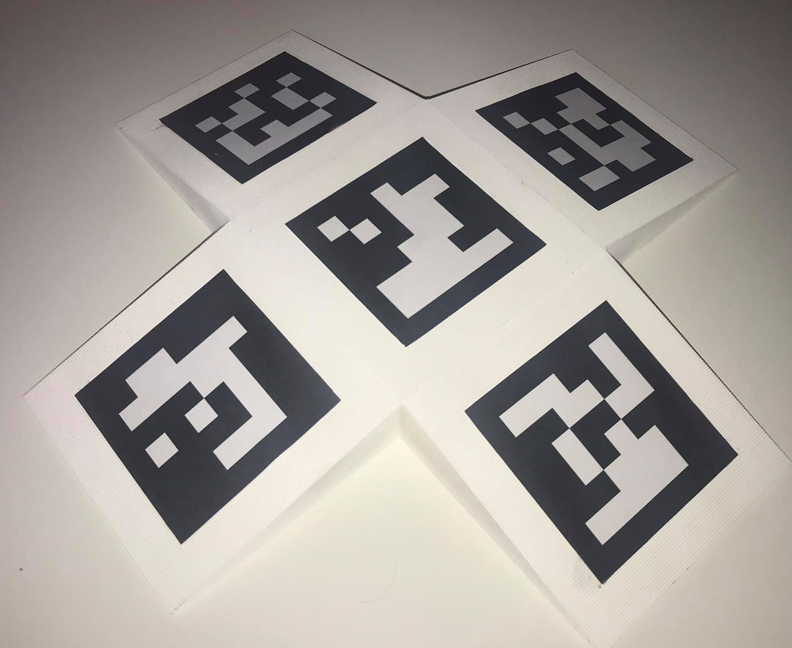
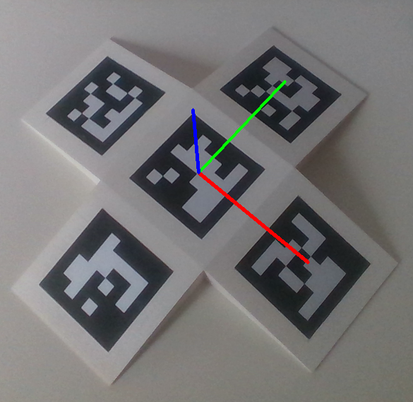

# 3D-gridboard-pose-estimation

 

3D Aruco gridboard pose estimation library

Based on OpenCV ArUco tag detection.  

For generate ArUco tag, you can used online generator: https://chev.me/arucogen/

  
  

#
Created by 

Petr Oscadal 

Department of Robotics VSB-TUO

2020
#